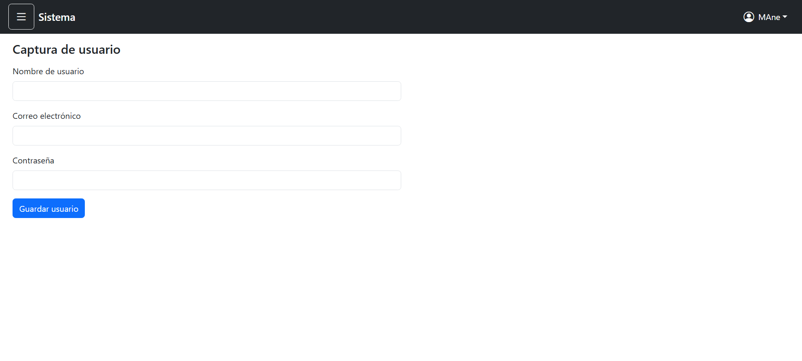
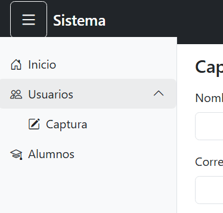
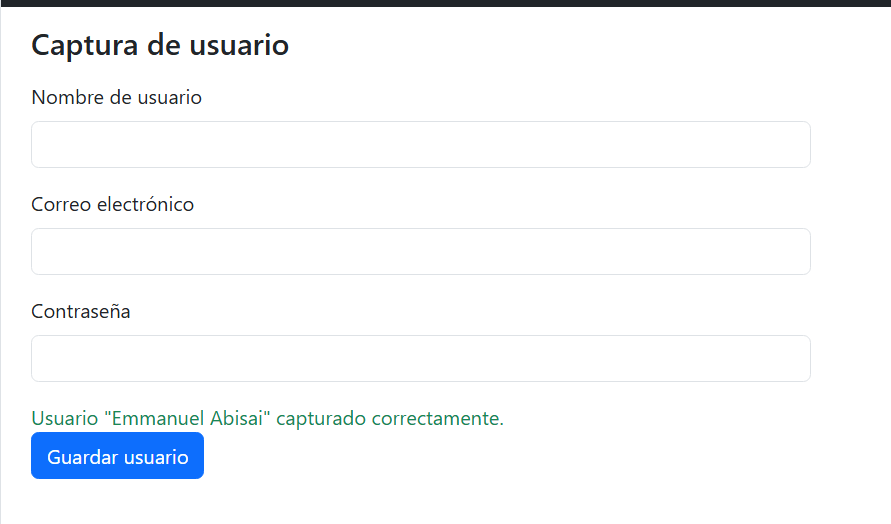
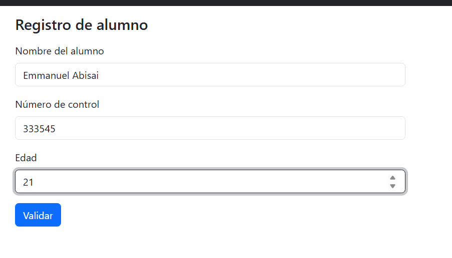
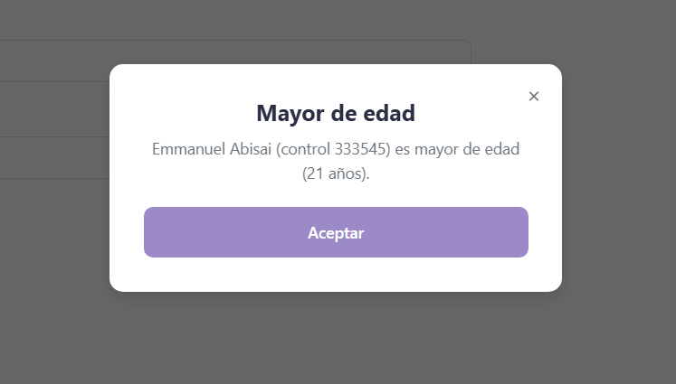
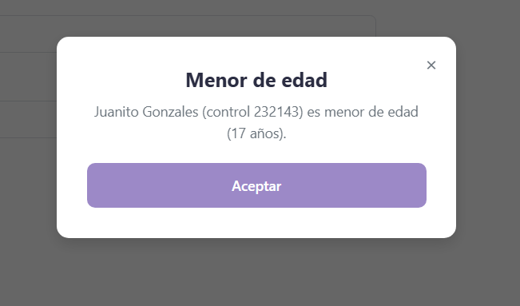

#  Proyecto: Sistema de Login y Dashboard - Actividad 5
**Asignatura:** Programación Web  
**Catedrático:** Ing. Adelina Martínez  
**Institución:** Instituto Tecnológico de Oaxaca (ITO) - 7mo Semestre  

###  Integrantes del Equipo 
1. **Garcia Ortega Oscar Zuriel** 
2. **Ambrocio Garcia Emmanuel Abisai** 

---

##  Descripción del Proyecto
Este proyecto es una simulación de un sistema web completo (Pantalla de Acceso y Panel Principal), desarrollado con HTML, CSS y JavaScript puro (Vanilla JS). Se implementó un control de acceso del lado del cliente utilizando la API de `localStorage` para la persistencia de datos, asegurando la navegación sin necesidad de un backend. 

* **Framework CSS utilizado:** Bootstrap 5 (Para maquetado responsivo, tarjetas, navbar y modal).
* **Librerías externas:** SweetAlert2 (Para alertas interactivas).

---

##  Explicación del Flujo y Documentación

### 1. El Módulo de Login y Seguridad 
El proceso de acceso inicia en el archivo `login.html`. Las características principales de esta vista son:
* **Validación Estricta (Regex):** Se implementó una Expresión Regular en `login.js` para asegurar contraseñas fuertes. Obliga al usuario a ingresar al menos 8 caracteres, incluyendo una mayúscula, un número y un carácter especial.
* **Manejo de Errores Visuales:** Si el usuario no cumple los requisitos o deja campos vacíos, se activan las clases `is-invalid` de Bootstrap y se dispara una alerta de SweetAlert2, deteniendo el envío del formulario.
* **Persistencia de Datos:** Al pasar la validación, el sistema utiliza `localStorage` para guardar el correo del usuario (`usuarioSistema`). 
* **Generación de ID:** Se llama a la función `generarIdSesion()` (alojada en `utileria.js`) para crear un token alfanumérico aleatorio (`idDeSesion`) que simula el token de un backend. Finalmente, se redirige a `index.html`.

### 2. Panel Principal y Utilerías

Una vez dentro de `index.html`, el sistema despliega un **panel principal (dashboard)** con un menú lateral (sidebar) y dos secciones funcionales: captura de usuarios y registro/validación de alumnos.

* **Sidebar colapsable:** El panel cuenta con un botón de hamburguesa en el navbar que colapsa/expande el menú lateral (`sidebar-colapsado` / `contenido-expandida`), permitiendo ganar espacio de pantalla. Esto se controla con `classList.toggle()` en `index_5.js`, y los estados visuales (oculto/visible, con o sin margen) están definidos en `login.css`.
* **Submenú desplegable:** Dentro del sidebar, la opción "Usuarios" despliega un submenú ("Captura") al hacer clic, usando la misma lógica de `classList.toggle("submenu-abierto")`.
* **Navegación entre secciones sin recargar la página:** Los enlaces "Captura" y "Alumnos" del sidebar controlan qué `<section>` se muestra dentro de `<main>`, ocultando una y mostrando la otra con la clase `d-none` de Bootstrap.
* **Formulario de Captura de usuario:** Valida que el nombre no esté vacío, que el correo tenga formato válido y que la contraseña cumpla un mínimo de seguridad (letras y números), mostrando mensajes de éxito/error en pantalla.
* **Formulario de Registro de alumno:** Valida que el número de control tenga exactamente 6 dígitos y que la edad sea un número válido. Al validarse correctamente, calcula si el alumno es mayor o menor de edad.
* **Componente Modal personalizado (`ModalUI`):** En vez de usar el modal nativo de Bootstrap, se desarrolló un componente propio y reutilizable (`js/Modal.js` + `css/modal.css`), creado originalmente en una actividad anterior. Este componente genera dinámicamente un overlay con una cajita centrada, título, cuerpo y botones configurables, y es el que se usa para mostrar el resultado de "Mayor de edad / Menor de edad" al validar un alumno.

---

##  Proceso de Creación (Paso a Paso)

**Parte 1: Base y Acceso**
1. Inicialización del repositorio y configuración inicial de ramas.
2. Maquetado de la interfaz `login.html` usando el sistema de grillas y componentes (Cards, Form-floating) de Bootstrap 5.
3. Desarrollo del script `login.js` para interceptar el evento `submit`, validando campos y redirigiendo.
4. Separación de código lógico creando el archivo `utileria.js` para almacenar herramientas globales (como el generador de ID).

**Parte 2: Dashboard y Componentes**
1. Maquetado de `index.html` con Bootstrap 5: navbar fijo, sidebar (`<aside>`) con menú de navegación, y `<main>` con las secciones de "Captura de usuario" y "Registro de alumno".
2. Desarrollo de `index_5.js` para controlar toda la interacción del panel: verificar sesión activa con `localStorage`, mostrar el nombre de usuario en el navbar, colapsar/expandir el sidebar, abrir/cerrar el submenú de "Usuarios", y alternar entre las dos secciones del panel.
3. Se agregaron las funciones de validación (`validarCorreo`, `validarPassword`, `validarNumeroControl`, `esMayorDeEdad`) para los formularios de Captura y Alumnos.
4. Se retomó el componente `ModalUI` desarrollado en la Actividad 4 (originalmente una demo aparte con calculadora de edad, confirmación y aviso informativo) y se integró al proyecto: se separaron sus estilos en `css/modal.css` y su lógica en `js/Modal.js`, quitando el código específico de la demo para dejar solo el componente reutilizable.
5. Se reemplazó el modal nativo de Bootstrap que se usaba para mostrar el resultado de "Mayor/Menor de edad" por una llamada a `ModalUI.mostrar({...})`, pasándole el título y el cuerpo según el resultado del cálculo de edad.
6. Se ajustó el botón de "Verificar edad" a "Validar" para mayor claridad, y se depuró el CSS para que el sidebar, el submenú y el modal se vieran correctamente integrados con el resto del diseño Bootstrap.

---

##  Capturas de Pantalla del Flujo

### 1. Pantalla de Acceso 

*(Nota: Si se introducen datos incorrectos, los campos se marcan en rojo).*

### 2. Panel Principal (Dashboard)

### 3. Validación de Alumnos y Modal de Edad

---

##  Enlaces Oficiales
* **Repositorio en GitHub:** [https://github.com/OscarZurielGarciaOrtega/login-web]
* **Sitio en Vivo (GitHub Pages):** [PEGA AQUÍ EL LINK DE GITHUB PAGES]